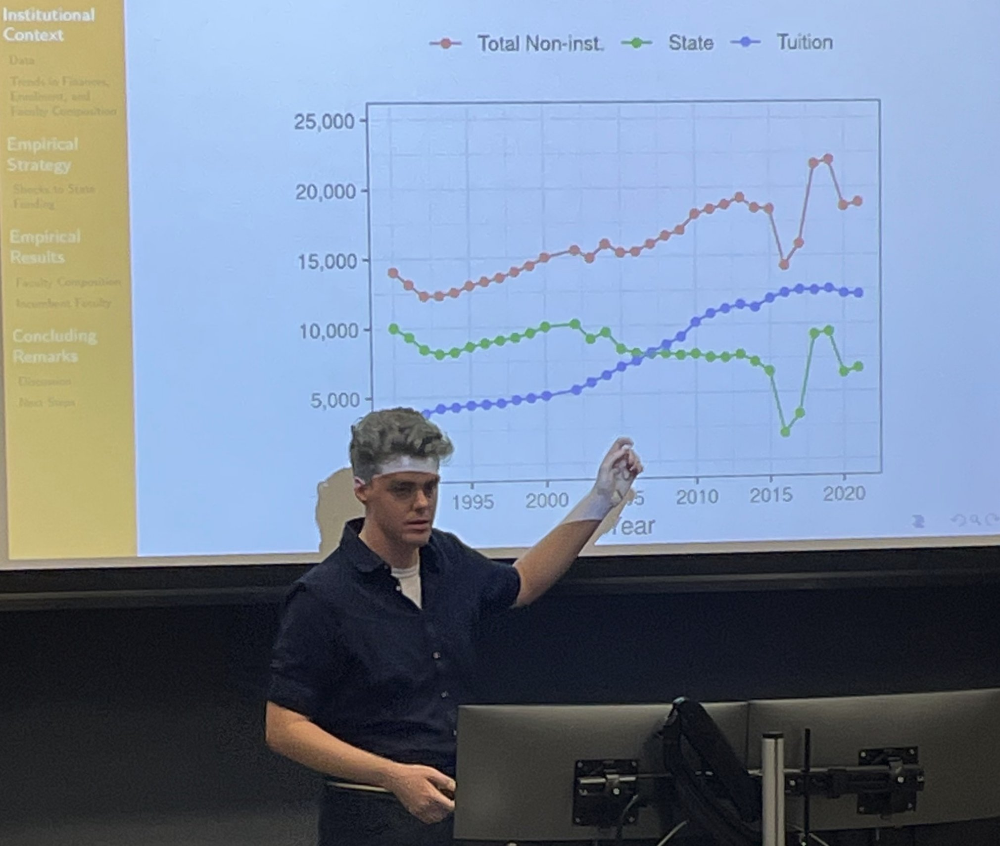

I am a PhD student in the Department of Economics at Cornell University, and my research focuses on estimating causal effects in empirical labour economics.
My primary focus uses econometric methodology, and tools from data science to build unique data, to uncover the underlying systems and economic processes.

  

I am passionate about the study of inequality, data-centric research, and open-source software.
Take a look at my early stage thoughts in my [posts tab](https://shoganhennessy.github.io/year-archive/).

You can see my [CV here](https://shoganhennessy.github.io/files/cv/cv-shoganhennessy.pdf), and my [Cornell profile here](https://economics.cornell.edu/senan-hogan-hennessy).[^1]

When not contributing to my research, I am usually [riding my bike](https://shoganhennessy.github.io/cycling/).

[^1]: My personal website is powered by the [academicpages template](https://github.com/academicpages/academicpages.github.io) and hosted on [GitHub pages](https://pages.github.com).
