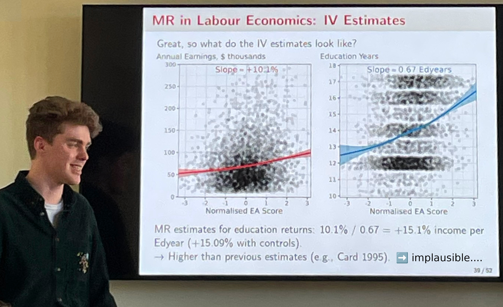

I am a PhD student in the Economics Department at Cornell University, and my research is in labour economics.
My economics [job market project](https://shoganhennessy.github.io/research/) focuses on:

- Identifying whether genes associated with education affect labour market outcomes directly or through educational choices, using Mendelian inheritance as a natural experiment
- Demonstrating that genetic effects on labour outcomes operate primarily through higher education rather than directly - challenging deterministic interpretations and re-instating the role of human capital development
- Developing new methodological methods to analyse mechanisms behind causal effects in observational studies, acknowledging selection in a causal mediation framework.

  

I am passionate about the study of inequality, data-centric research, and open-source software.
Take a look at my thoughts in my [posts tab](https://shoganhennessy.github.io/year-archive/), details on my academic work in my [research tab](https://shoganhennessy.github.io/research/).

You can see my [CV here](https://shoganhennessy.github.io/files/cv/cv-shoganhennessy.pdf), and my [Cornell profile here](https://economics.cornell.edu/senan-hogan-hennessy).

When not working, I am usually [cycling](https://shoganhennessy.github.io/cycling/).
