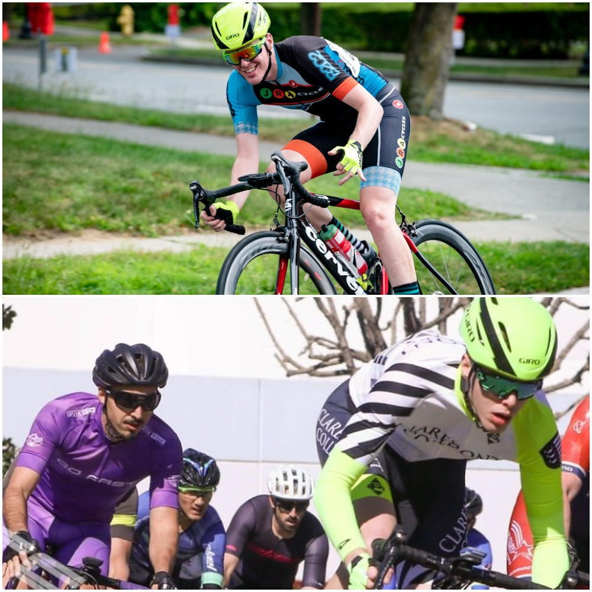

Road cycling is my main hobby, outside of academic pursuits.

When I lived Boston I joined my current amateur racing team, [B2C2 Cycling](http://b2c2cycling.com/).
We're committed to equality in the sport, and generally having a good time on two wheels.

I started cycling at Pomona College, where I became the president of the college cycling club, and made some great friends in the local race scene from Cal State Fullerton and Team Go-Fast.

Strava is the only social media platform I use, so you can follow my cycling over here.

<iframe height='454' width='49%' frameborder='0' allowtransparency='true' scrolling='no' src='https://www.strava.com/athletes/7741397/latest-rides/b07ae5dcfcb65768a929e80a30b9b7c3844bf916'>
</iframe>

<iframe height='160' width='49%' frameborder='0' allowtransparency='true' scrolling='no' src='https://www.strava.com/athletes/7741397/activity-summary/b07ae5dcfcb65768a929e80a30b9b7c3844bf916'>
</iframe>
