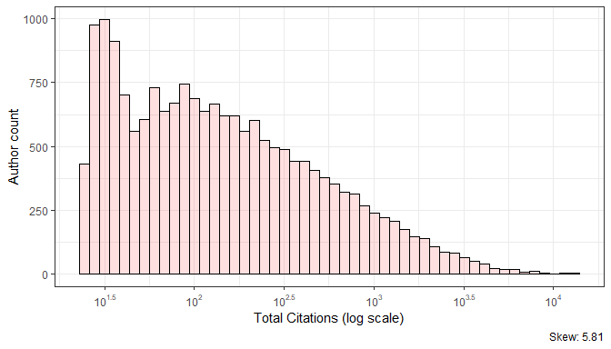
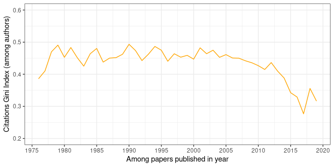
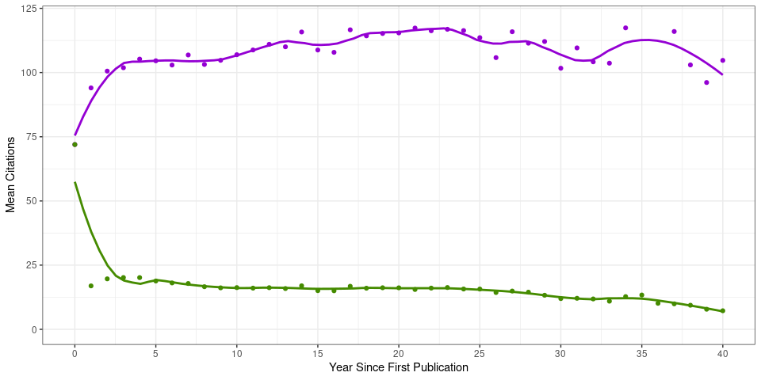
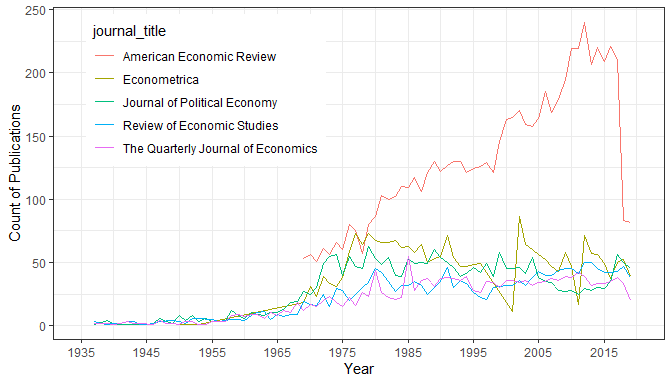
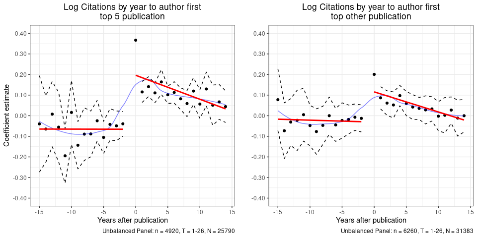

In the summer before starting my PhD, I collected multiple data sources
about economists.
This is my first post, a first pass at playing with those data.
The source code is available in [this
repo](https://github.com/shoganhennessy/Econ_text_data/), so feel free
to look over and reproduce from there (which is filled mostly with code
in *R* and *Python*).

-----

# The Ideas.RePEc Listings of Articles in Economics

The NBER series is a great source of research in our profession, but it
isn’t the full picture of research in the field. It is, after all, a
listing of working papers which are not yet publications – though most
do go on to be published, as I noted in the [last
post.](https://github.com/shoganhennessy/Econ_text_data/blob/master/Blog_post_exploration/1_NBER_working_papers.md)

Fortunately, [Research Papers in Economics (RePEc)’s
Ideas](https://ideas.repec.org/) provides a large listing of economics
research which I can use as a complement to the NBER listings as it
lists information on 57,532 economists and 421,348 published articles
papers – considering only those in English as of 9 January 2020.

> ‘’IDEAS is the largest bibliographic database dedicated to Economics
> and available freely on the Internet. Based on RePEc, it indexes over
> 3,000,000 items of research, including over 2,700,000 that can be
> downloaded in full text.’’
> 
> – What is IDEAS? [Ideas.RePEc.org/](https://ideas.repec.org/)

421,348 is a huge number of articles to consider, and comparable in size
to articles that use the near complete set of
publications.[1](#f1) RePEc has certain advantages:
it is more open and it has a clear link to authors – and importantly
some of their characteristics – to working and published papers, all
within the field of economics. It is however, a repository only within
the economics sphere: citations are only counted among other papers in
the database, and not among the universe of publications.

This post looks at two key measures of publication quality in economics:
citations and the top 5 journals. The distribution of citations is
looked at by visualisations with discussion of how to interpret the
statistics, before the top 5 economics journals are investigated for
their influential place in the field of economics as well as their place
in these data.

### Citations

For a sanity check, take a look at the most prolific authors in the
field by citation count.[2](#f2)

<table>
<thead>
<tr>
<th style="text-align:left">author_name</th>
<th style="text-align:right">total_citations</th>
<th style="text-align:right">mean_citations</th>
<th style="text-align:right">total_articles</th>
</tr>
</thead>
<tbody>
<tr>
<td style="text-align:left">Andrei Shleifer</td>
<td style="text-align:right">13816</td>
<td style="text-align:right">150</td>
<td style="text-align:right">92</td>
</tr>
<tr>
<td style="text-align:left">James J. Heckman</td>
<td style="text-align:right">12845</td>
<td style="text-align:right">130</td>
<td style="text-align:right">99</td>
</tr>
<tr>
<td style="text-align:left">Daron Acemoglu</td>
<td style="text-align:right">12007</td>
<td style="text-align:right">111</td>
<td style="text-align:right">108</td>
</tr>
<tr>
<td style="text-align:left">Jean Tirole</td>
<td style="text-align:right">11602</td>
<td style="text-align:right">130</td>
<td style="text-align:right">89</td>
</tr>
<tr>
<td style="text-align:left">Joseph E. Stiglitz</td>
<td style="text-align:right">11070</td>
<td style="text-align:right">101</td>
<td style="text-align:right">110</td>
</tr>
<tr>
<td style="text-align:left">René M. Stulz (Rene M. Stulz)</td>
<td style="text-align:right">9884</td>
<td style="text-align:right">145</td>
<td style="text-align:right">68</td>
</tr>
<tr>
<td style="text-align:left">John List</td>
<td style="text-align:right">8559</td>
<td style="text-align:right">93</td>
<td style="text-align:right">92</td>
</tr>
<tr>
<td style="text-align:left">John Y. Campbell</td>
<td style="text-align:right">8423</td>
<td style="text-align:right">153</td>
<td style="text-align:right">55</td>
</tr>
<tr>
<td style="text-align:left">David E. Card</td>
<td style="text-align:right">8159</td>
<td style="text-align:right">138</td>
<td style="text-align:right">59</td>
</tr>
<tr>
<td style="text-align:left">Asli Demirguc-Kunt</td>
<td style="text-align:right">8150</td>
<td style="text-align:right">143</td>
<td style="text-align:right">57</td>
</tr>
</tbody>
</table>

There are some familiar faces among the names, which is to be expected\!
The process of assigning is, however, not perfect: citations are
assigned from each article to each author equally when there are
multiple authors. Yet [Sarsons
(2017)](https://www.aeaweb.org/articles?id=10.1257/aer.p20171126) shows
how inappropriate this accounting is by exhibiting the unequal citation
rate of return in among economists by gender – which actually inspired
me to work with economics publishing data in the first place\! Call it a
point of interest to rank economists by better measures in the future,
as this project progresses.

The above top ten are at the very top of the field and citations are, of
course, not evenly distributed across researchers in the field. So what
does the wider distribution look like?

Citations are positively skewed among authors, so much so that the
distribution above can only be visualised well with a log scale in
citations: the top of the distribution has orders of magnitude more
citations than the rest. One might call this distribution *unequal*, but
is the distribution *unequal* for all the years of these data?

The Gini coefficient measures income inequality in economics, where 0 is
perfect equality and 1 perfect inequality. The coefficient is stable
among citations for authors per year between 0.5 and 0.45, which
(perhaps) implies a distribution with only moderate inequality – compare
it to the US income distribution, which has a similar value. Yet it is
not fully clear what this entails; citation counts are not income so
that the comparison does not hold direct meaning. A Gini coefficient,
while interesting, is a crude measure of inequality among publications.

The above shows mean yearly citations across every author following
their first publication. Be aware that the measure considers citations
of papers, so that citations are attributed to the year of publication
and not the year of citation being made.[3](#f1)

My data set of papers is formatted at the individual paper level (each
row is a paper), so that summary statistics on this only consider years
in which papers appear, a measure of citations conditional on active
publication in that year (giving the purple lines). Another measure
includes years when authors do not publish, where citations in that year
are zero, an unrestricted measure of citations (giving the green lines).
If there is at least one publication in that year, citations in papers
after the first are relatively constant for the following years around
100 to 120. Without this restriction mean citations fall from around 20
to 10, showing attenuation in the group of authors who continue to
publish years after their first paper.

### The Top 5

It well known in economics that the top five journals hold an outside
influence in publishing and the power structure of our field. Recently
this has been referred to as a tyranny ([Heckman, Moktan 2020
forthcoming](https://www.aeaweb.org/articles?id=10.1257/jel.20191574&&from=f)),
where publishing in one of these journals heavily influences a tenure
decision and thus makes (or breaks) an academic economics career.

The top 5 journals are comprised of the American Economic Review,
Econometrica, the Journal of Political Economy, the Quarterly Journal of
Economics, and the Review of Economic Studies. These data contain 15,059
total articles from the top 5, showing a clear rise in the number
released by AER to the end of the 20th century – but also sample
attrition from the year 2018 and on.

We see the top 10 ranked by mean citations, which naturally has the top
5 at the top (who would have thought?). Notably the top 5 are not the
first five when ranked by citations per article though they do rank at
rank very highly in that regard. This is documented previously by
[Anauati et
al. (2018)](https://onlinelibrary.wiley.com/doi/abs/10.1111/ecin.12867).

| Journal name                           | Mean citations per article | Total citations | Count articles |
| :------------------------------------- | -------------------------: | --------------: | -------------: |
| American Economic Review               |                        102 |          301142 |           2954 |
| Journal of Political Economy           |                        112 |          142477 |           1271 |
| The Quarterly Journal of Economics     |                        137 |          129378 |            945 |
| Econometrica                           |                        103 |          129028 |           1247 |
| The Review of Economics and Statistics |                         84 |           97737 |           1169 |
| Journal of Finance                     |                        112 |           97687 |            870 |
| Economic Journal                       |                         83 |           93447 |           1132 |
| Journal of Financial Economics         |                        107 |           92602 |            866 |
| Journal of Econometrics                |                         84 |           89413 |           1068 |
| Journal of Public Economics            |                         73 |           88089 |           1207 |

Economics’ focus on the top 5 has been been dubbed *Top5itis*, a disease
inflicting our field leading to tunnel vision for those with power in
our field. While humorous in description, the problem is nonetheless
real, and these data give a perfect opportunity to observe and study the
phenomenon. The design below is a start in using these data for this
purpose, hopefully leading to work on how to address the problem.

> Indeed, serious theoretical and empirical work should be conducted to
> understand this disease better and suggest possible treatments. The
> problem will probably require challenging techniques in applied
> mechanism design.
> 
> – [Top5itis, R Serrano (2018)](http://hdl.handle.net/10419/202594)

### Top 5 Publication as an event

If publication in a top journal really can change a career, then it
makes sense to think about as an *event*. This can be drawn as a linear
model, with a coefficient on the year of the author’s first publication
in the top5 (including fixed effects for author *i* and calendar year
*t*), to give an event study for publication in a top journal. The
outcome of interest here can be a measure of academic success, which
here will be log citations for author *i* in year *t*.

The design can similarly be applied to the next 5 prestigious journals
(of the top 10 ranking), to give a similar event to compare.

In terms of log citations, authors have a real and persistant bump to
their citations in years following their first publication in a top 5
journal. The bump also exists for the first publication in one of the
next most respected journals (the comparison figure on the right), and
is at least smaller than that for the top 5.

Be aware that this is a relatively simple linear model: it shows not
much more than the fact authors once published in the top 5 receive more
citations over the next 15 years.  
While there are fixed effects controls for unobserved differences among
individuals, there is no direct causal identification (or inference);
the measure of citations is still from year
published,[3](#f3) and sample selction is likely
rampant in this design. For example, the model considers both authors
who get to the top 5 in their second active year of writing with people
who finally make it after 16 active years, despite these authors are not
likely comparable (even with fixed effects included).

Lastly, the citation count measure used throughout these sections is an
easy measure of research success for this and other projects thanks to
its availability, yet is an imperfect measure of actual research
penetration. In fact its use as a goal for researchers, and following
*citation maximisation* behaviour is speculated to be part of the
stagnation in science research advances ([Bhattacharya,
Packalen 2020](https://www.nber.org/papers/w26752)). So it pays to take
analyses of citations, such as the ones in this post, with a grain of
salt.

### Conclusion

This post described the IDEAS.RePEc data, and the opportunity it
represents to to measure economics publication and their outcomes.
Hopefully use of these data and further ‘’applied mechanism design’’
([Serrano 2018](http://hdl.handle.net/10419/202594)) will help us
understand the world of economics publications better.

**Next up:** Looking at inclusion in the *NBER family*.

-----

### Footnotes

<b id="f1">1</b> [Angrist et
al. (2017)](https://www.nber.org/papers/w23698) link Econlit and Web of
Science for similar coverage, for example.[↩](#a1)

<b id="f2">2</b> Again, note that this citation count is not the same as
that in the universe of academic publications or Google Scholar, it is a
count of the citations within the RePEc listings so a measure of
citations within only this large coverage of the field.[↩](#a2)

<b id="f3">3</b> The count of citations when they are made is
*significantly* more difficult to create, yet is in the works.[↩](#a3)

-----

### References

Anauati, M. V., Galiani, S., & Gálvez, R. H. (2018). Differences in
citation patterns across journal tiers: The case of economics. Economic
Inquiry.

Angrist, J., Azoulay, P., Ellison, G., Hill, R., & Lu, S. F. (2017).
Inside job or deep impact? Using extramural citations to assess economic
scholarship (No. w23698). National Bureau of Economic Research.

Bhattacharya, J., & Packalen, M. (2020). Stagnation and Scientific
Incentives (No. w26752). National Bureau of Economic Research.

Heckman J, & S Moktan. (2020) Publishing and Promotion in Economics: The
Tyranny of the Top Five. Journal of Economic Literatue (forthcoming).

Sarsons, H. (2017). Recognition for group work: Gender differences in
academia. American Economic Review, 107(5), 141-45.

Serrano, R. (2018). Top5itis (Brown University No. 2018-2). Working
Paper.
