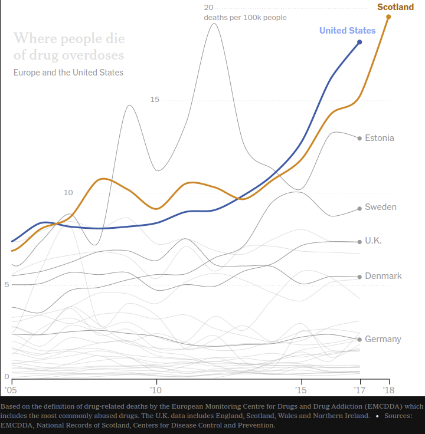
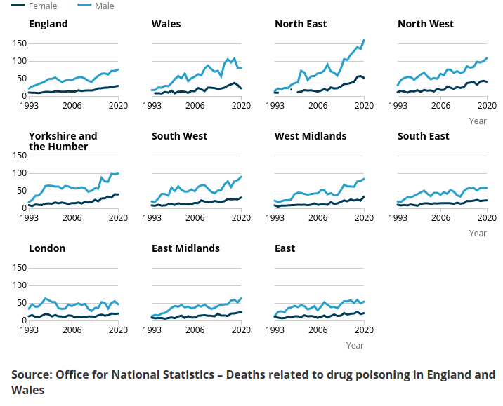

Back in the summer of 2019 I picked up a print edition of the New York Times (NYT) in a coffee shop, and became entranced by an [article about rates of opioid overdoses in Scotland.](https://www.nytimes.com/2019/08/07/world/europe/scotland-heroin-deaths.html)[^1]
The article discusses rates of opioid and heroine use in Scotland, and makes a brief comparison to rates in the United States (US).

Per capita rates of drug overdose in each nation seem to be near identical, which I find fascinating.
The rest of the United Kingdom (UK, which mostly represents England thanks to its over-sized population in the British Isles) has not the same trend to the US and Scotland, despite being only a short border crossing away.
Is this merely a statistical irregularity?
Perhaps there is there a joint explanation for the US and Scotland's similar trend in overdose rate.

## The Trainspotting Generation

The UK and the US have long been considered close counterparts, sharing many similarities including similar per capita income and the same language.
Their main difference is in size, where the US is much large in population and area.
[This table (reproduced from Wikipedia)](https://en.wikipedia.org/wiki/Countries_of_the_United_Kingdom#Statistics) compares the composition of the UK with the US to paint the picture.

<table class="wikitable sortable">
<tbody><tr>
<th rowspan="2">Name
</th>
<th colspan="2">Population (2019)
</th>
<th colspan="2">Area
</th>
<th rowspan="2">Pop.&#160;density (per&#160;km2;&#160;2019)
</th>
<th colspan="3"><a href="https://en.wikipedia.org/wiki/Gross_value_added" title="Gross value added">Gross value added</a> (2015)
</th></tr>
<tr>
<th>Numbers
</th>
<th>%
</th>
<th>km2
</th>
<th>%
</th>
<th><a href="https://en.wikipedia.org/wiki/Pound_sterling" title="Pound sterling">£</a>
</th>
<th>%
</th>
<th>£ per capita
</th></tr>
<tr>
<td align="center"><a href="https://en.wikipedia.org/wiki/England" title="England">England</a>
</td>
<td align="right">56,286,961
</td>
<td align="right">84%
</td>
<td align="right">130,279
</td>
<td align="right">54%
</td>
<td align="right">432.05
</td>
<td align="right">1,433 billion
</td>
<td align="right">86%
</td>
<td align="right">26,159
</td></tr>
<tr>
<td align="center"><a href="https://en.wikipedia.org/wiki/Northern_Ireland" title="Northern Ireland">Northern&#160;Counties of Ireland</a>
</td>
<td align="right">1,893,667
</td>
<td align="right">3%
</td>
<td align="right">13,562
</td>
<td align="right">5.5%
</td>
<td align="right">139.63
</td>
<td align="right">34 billion
</td>
<td align="right">2%
</td>
<td align="right">18,584
</td></tr>
<tr>
<td align="center"><a href="https://en.wikipedia.org/wiki/Scotland" title="Scotland">Scotland</a>
</td>
<td align="right">5,463,300
</td>
<td align="right">8%
</td>
<td align="right">77,933
</td>
<td align="right">32%
</td>
<td align="right">70.10
</td>
<td align="right">127 billion
</td>
<td align="right">8%
</td>
<td align="right">23,685
</td></tr>
<tr>
<td align="center"><a href="https://en.wikipedia.org/wiki/Wales" title="Wales">Wales</a>
</td>
<td align="right">3,152,879
</td>
<td align="right">5%
</td>
<td align="right">20,735
</td>
<td align="right">8.5%
</td>
<td align="right">152.06
</td>
<td align="right">56 billion
</td>
<td align="right">3%
</td>
<td align="right">18,002
</td></tr>
<tr>
<td align="center"><b><a href="https://en.wikipedia.org/wiki/United_Kingdom" title="United Kingdom">United&#160;Kingdom</a></b>
</td>
<td align="right"><b>66,796,807</b>
</td>
<td align="right"><b>100%</b>
</td>
<td align="right"><b>242,509</b>
</td>
<td align="right"><b>100%</b>
</td>
<td align="right"><b>275.44</b>
</td>
<td align="right"><b>1,666 billion</b>
</td>
<td align="right"><b>100%</b>
</td>
<td align="right"><b>25,351</b>
</td></tr>
<tr>
<td align="center"><b><a href="https://en.wikipedia.org/wiki/United_States" title="United States">United&#160;States</a></b>
</td>
<td align="right"><b>332,401,635</b>
</td>
<td align="right"><b> </b>
</td>
<td align="right"><b>9,147,420</b>
</td>
<td align="right"><b> </b>
</td>
<td align="right"><b>36.34</b>
</td>
<td align="right"><b>11.666 trillion</b>
</td>
<td align="right"><b> </b>
</td>
<td align="right"><b>35,108</b>
</td>
</tr></tbody></table>

It is clear that England is the dominant country in the UK, with the largest population and income for the region.
Interestingly, the UK Office of National Statistics has documented that the rise in drug overdoses in the UK is concentrated outside of South England.[^2]
The South of England is the most densely populated area of England, so its relative lack of drug overdoses likely explains why statistics for the UK as a whole do not show a rise in drug overdoses, as we see in Scotland.

The UK has a well-documented North-South divide, where UK prosperity is concentrated in Southern England -- the area that historically the aristocracy and wealth of the UK have been centred.
The North of England, Wales, and Scotland saw dramatic rises in living standards with the industrialisation of the the 1800s to mid-1900s.
Yet, since the deindustrialisation following the 1950s, the North has seen a relative (to the South) fall in living standards.
The relative position of Scotland, and North England, to the South is observed across cultural and media depictions of the areas, with the most memorable from a speech in the topical film Trainspotting.
It is, after all, no coincidence that the NYT article refers to Scotland's generational equivalent of the US "Generation X" as the "The Trainspotting Generation."[^3]

<iframe width="560" height="315" src="https://www.youtube.com/embed/xCtPBFHKSNg?controls=0&amp;start=39" title="YouTube video player" frameborder="0" allow="accelerometer; autoplay; clipboard-write; encrypted-media; gyroscope; picture-in-picture" allowfullscreen></iframe>

<video width="560" height="315" controls>
  <source src="../files/posts/2021-12-29-overdoses-in-scotland-and-the-united-states-files/trainspotting-scene.mp4" type="video/mp4">
</video>

Similarly, drug overdoses are also rising in the Northern Counties of Ireland, which has a very similar cultural position in the UK to Scotland since the 1996 peace agreement.[^2]
The relative rise in opioid overdose viewed from the perspective of Scotland, and the North-South divide, sounds similar to the US-focused hypothesis of "Deaths of Despair."
Professors Case and Deaton developed a theory to explain declining white working-class life expectancy in the US, and how this relates to pain medication, alcoholism, and suicide rates in deindustrialised areas of the US.[^4]
It seems, to me, that the issue is not uniquely American.

## Future Work

This post has looked at aggregate statistics on the rates of overdose in Scotland.
Considering that the relatively prosperous South England has not seen a similar rise in overdoses, while Scotland and similar areas in the UK have seen the rise, I think that this could provide evidence for the Deaths of Despair Hypothesis for deindustrialised areas of the UK.

The topic of rising overdoses in Scotland has not been focused in research; I could only find a literature view on the topic from a public health view ([https://doi.org/10.1159/000516165](https://doi.org/10.1159/000516165)).
The issue could do with quality empirical work:
I think a health economics project could provide an explanation by using the UK and Ireland's Northern counties as comparisons (or constructed controls) for where overdoses have and have not risen over the last 20 years.
Finding an explanation for why the South of England saw little rise in overdoses, while Scotland did, would be a huge development in understanding the Western World's problems with drug overdoses.
It can even have explanations for the "opioid epidemic" in the US.

I haven't found an angle to tackle this well myself, nor any interesting sources of data to further investigate the topic.
If any economist or data scientists read this and have further ideas to work on this topic, then please feel free to run with the idea.
I would love if you send me an email with your thoughts, or want a conversation about this topic.
[Raise a Github issue for this post](https://github.com/shoganhennessy/shoganhennessy.github.io/issues/new/choose) if you have any particular comments.

-----

### Footnotes

[^1]: The article is a fantastic piece of journalism, well written with beautiful graphs and photography.  I would recommend it to all.  The graphs presented are from the article.  Allison McCann, Mary Turner, NYT  "As Scotland’s ‘Trainspotting’ Generation Ages, the Dead Pile Up"  7 August 2019;  [https://www.nytimes.com/2019/08/07/world/europe/scotland-heroin-deaths.html](https://www.nytimes.com/2019/08/07/world/europe/scotland-heroin-deaths.html)

[^2]: The ONS hosts their data reports, and graphs, online in the following report.  It is a worth read for unbiased views and data on the topic.  [https://www.ons.gov.uk/peoplepopulationandcommunity/birthsdeathsandmarriages/deaths/bulletins/deathsrelatedtodrugpoisoninginenglandandwales/2020](https://www.ons.gov.uk/peoplepopulationandcommunity/birthsdeathsandmarriages/deaths/bulletins/deathsrelatedtodrugpoisoninginenglandandwales/2020)  Equivalent organisations for the semi-autonomous regions of Scotland and the Northern Counties of Ireland have similar reports on the issue:  [https://www.nisra.gov.uk/publications/drug-related-and-drug-misuse-deaths-2009-2019](https://www.nisra.gov.uk/publications/drug-related-and-drug-misuse-deaths-2009-2019); [https://www.nrscotland.gov.uk/statistics-and-data/statistics/statistics-by-theme/vital-events/deaths/drug-related-deaths-in-scotland/2020](https://www.nrscotland.gov.uk/statistics-and-data/statistics/statistics-by-theme/vital-events/deaths/drug-related-deaths-in-scotland/2020)

[^3]: Trainspotting is a 1996 film (and book) about a band of heroin-addicted friends dealing with the cultural void that was their country, Scotland, in the 1990s.  It is without a doubt the best depiction of the modern implications of British colonialism to date.  [https://en.wikipedia.org/wiki/Trainspotting_(film)](https://en.wikipedia.org/wiki/Trainspotting_(film))

[^4]: There are many possible references for the Case Deaton approach explanation, the Deaths of Despair hypothesis.  They are all referenced in their 2020 summary book, "Deaths of Despair and the Future of Capitalism."  [https://press.princeton.edu/books/hardcover/9780691190785/deaths-of-despair-and-the-future-of-capitalism](https://press.princeton.edu/books/hardcover/9780691190785/deaths-of-despair-and-the-future-of-capitalism)  There has been some recent work (Ruhm 2018) that distinguishes between deaths of despair and drugs addiction.  I don't think there is as much of a distinction between the two as this work argues; drugs seem to be integrally linked to deaths of despair in a way that this work does not acknowledge.  [https://www.nber.org/papers/w24188](https://www.nber.org/papers/w24188)
