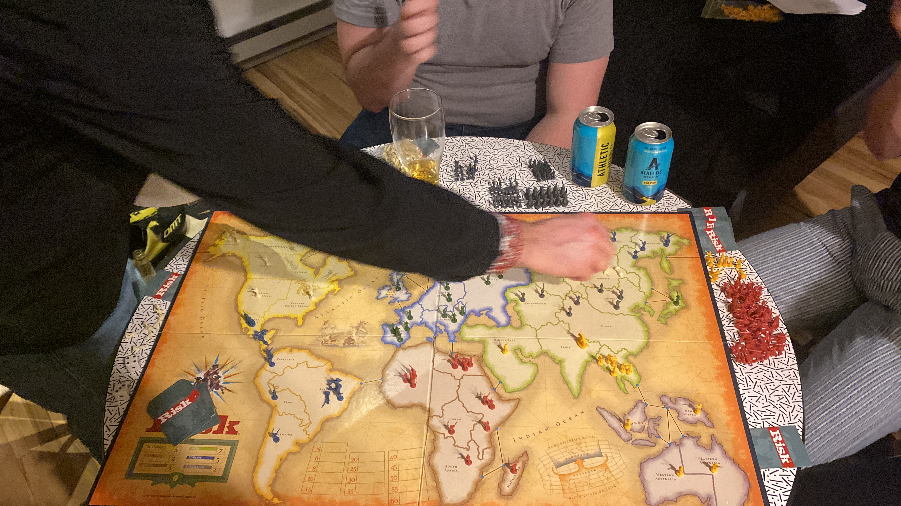
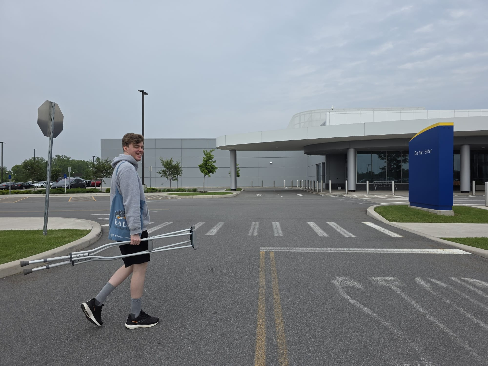

On Saturday 5 March, I woke from a weekend nap and could not stand up.
I fell right to the ground, then in a disoriented daze pulled myself to lean on one remaining leg that could bear my weight.
My degenerating hips seem to have finally given out on me.

## Degenerative Hip(s)

Degenerative injuries are long term worsening conditions, until they are not.
This spring, worsening hip pain clearly showed to be an injury worth proper attention.

What I had been dismissing as general aches was actually something called hip impingement.
This means the ball and socket of the hip joint do not fit together quite right.
Instead of gliding smoothly, the bones pinch and grind against the soft tissue between them.

Over time, this repeated pinching tears the labrum, a ring of cartilage that cushions the hip joint and helps hold it in place.
Think of the labrum like a rubber seal around a jar lid.
When intact, it creates a smooth, secure fit.
But constant grinding wears it down, creating tears and rough edges. Once torn, every movement catches on these damaged bits, sending sharp pains through the joint.

By March, my left hip labrum had torn sufficiently that my body simply refused to continue the charade of normal function.

## Seeking Medical Help (yikes)

At the hospital, when asked what happened, I could only offer: "I do not know, I fell down and now cannot walk."
It sounded absurd even as I said it.
I had been seeing a physiotherapist for a few months, strengthening muscles to manage minor hip pain.
But this sharp, stabbing pain with every attempted step was completely new.

The local healthcare system responded with its characteristic blend of thoroughness and inefficiency.
First came the X-rays, standard enough.
Then the magnetic resonance imaging --- scheduled a full month later. 
When I arrived for the MRI, I discovered that I was only booked imaging for one hip.
The second hip would require another appointment the following week.

Two separate visits, two separate bills, for what could have been easily accomplished in a single session.
One suspects this had less to do with medical necessity, and more to do with maximising health insurance billing by the hospital.
A couple of months later, letters from my insurance company suggest they are still disputing who owes what to whom.

Meanwhile, I hobbled about on what the scans eventually confirmed: bilateral labral tears with degenerative hip impingement.
The top of my femur bone had worn down, and jagged edges had torn some of the issue, on both the left and right side.
It turns out both my hips were properly damaged, not just the left one that had given out that March afternoon.

(1.) Friends visiting for a dinner party while I could not walk. | (2.) The after dinner Risk game.
:-----------------------------------------:|:-------------------------:
  |  

## Attaining Medical Help from an Actual Expert (a relief)

The first doctor rang me with her assessment: "It's minor. Continue with physiotherapy."
I relayed this to my physiotherapist at our next session.
She stopped me mid-sentence, concern crossing her face.

"May I see your medical report?"
After scanning through it, she looked up sharply.
"This is serious. You need to see a specialist."

Within the week, I found myself speaking to an orthopaedic surgeon from the University of Rochester, recommended by my physiotherapist.
Unlike the dismissive phone call from the last doctor, he took time to explain what the scans actually showed.
He spoke about how this type of injury --- hip impingement with labral tears --- is surprisingly common among young athletes.
The repeated motion gradually damages the joint until it reaches a breaking point.

"The good news," he said, "is that you can make a full recovery." 

The catch: I would need surgery on both hips.
No full hip replacements, thank god, but something called arthroscopic femuroplasty.
Through keyhole incisions, they would essentially sand down the jagged parts of my femur, then insert an implant to hold together the torn tissue.
Two separate operations, one for each side, followed by a few months of specialised physiotherapy to regain function and mobility.

It was daunting, but now someone was finally taking me seriously and offering a path forward.

## Preparing for an Operation (twice)

The orthopaedic office moved with surprising efficiency, booking me a surgery in just two weeks time --- left hip first.
Their pre-operative instructions were specific: take it easy and, crucially, avoid sitting upright.
Apparently sitting at ninety degrees puts particular strain on damaged hips, both before and after surgery.

Avoiding sitting upright meant reconfiguring my entire work setup; data economists (such as myself) spend most of their worked time sitting in front of a computer.
I alternated between lying down with a laptop propped on pillows, and a rather elaborate reclined arrangement at my main computer where all my data live.
Oddly, I found theoretical work easier to manage with constant hip pain --- what this says about economic theorists, I will leave to others to judge.
I turned my attention to the only paper I have written with any theoretical insights (which is not saying much, as I am no theorist by any stretch of the imagination).

(3.) Walking in to the hospital. | (4.) Waiting for my (first) hip operation.
:-----------------------------------------:|:-------------------------:
  |  

On 1 May, I travelled to Rochester for the left hip operation.
The day proved stressful, though somewhat alleviated by the valium that nurses kindly gave me.
Three hours later, I woke with a swollen hip, a fog of anaesthesia, and the good wishes of the nursing staff.
Since then, it has been physiotherapy twice a week, working to strengthen the left side enough to ahead of the operation on the other side.

During this time I improved a lot.
I went from walking on crutches with no weight on the left leg, to walking with a cane, to body weight squats on both legs in the physiotherapist's office.
I even made it to the university a few times, and made my way to outside activities with friends (walking stick keenly hidden by me in the photo).

  
(5.) Standing up outside, and pencilled notes made while reclined in hip pain --- as I presume all theory work is usually done.

  
  

Come 12 June, the left side had improved well enough that I was ready for the operation on the right side.
So again I went to the University of Rochester Surgery Centre, again I was ameliorated with hospital-provided valium, and again left the hospital with a surgically repaired hip.

## Finishing Up (finally)

My ordeal of going from active exercising daily to unable to walk was a surprising one.
It has happened at an inopportune time, with big deadlines for the completion of my PhD coming up.
But for now it seems like I will walk again unaided in a couple of months, and I can work through the final writing of my job market paper while rehabilitating this right hip.
All this with a number of new scars from the key-hole incisions at the top of both hips.

If nothing else, this experience has taught me the value of good physiotherapists, and the importance of advocating for your own medical care --- since no one else will.
Also, I learned that economic theory becomes marginally more interesting when you are confined to bed.
Though, I would not recommend this last lesson as a research strategy.
